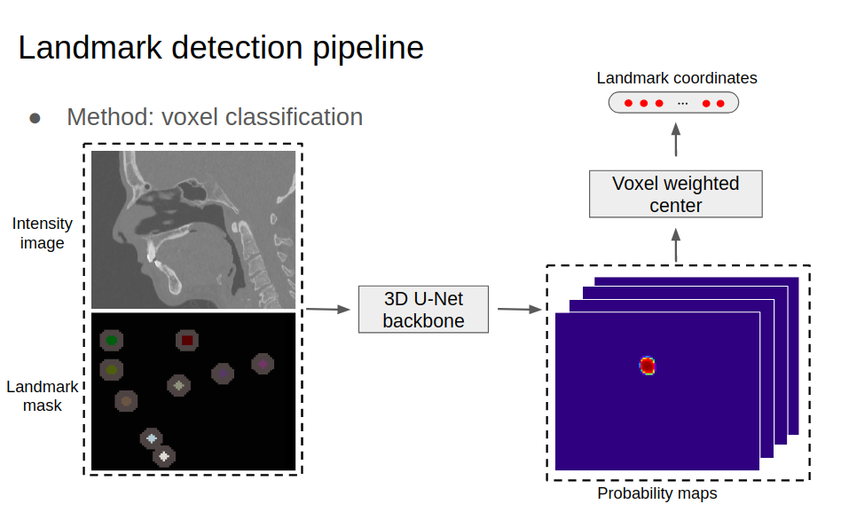

# Landmarking


<p align="center">
  
</p>

## Installation
The code is tested with ``python=3.8.8``, ``torch=2.0.0``, and ``torchvision=0.15.0``.
```
git clone https://github.com/MarwaAbderrahim/Landmarking.git
cd Landmarking-main
```
Create a new conda environment and install required packages accordingly.
```
pip3 install -r requirements.txt
```
## Preprocessing

### Step 1: Convert FCSV to CSV

To convert the ground truth file containing landmarks of each image from the FCSV format to CSV format, use the script located in `./preprocessing/fscv-to-csv.py`:

```bash
python preprocessing/fscv-to-csv.py -i input_folder -o output_folder


Replace input_folder with the path to the folder containing the FCSV files, and output_folder with the path to the folder where you want to save the CSV files.

Step 2: Round Values in CSV
To round the values in a CSV file, use the script named arrandissment-csv.py located in the ./preprocessing directory.

To run the script, execute the following command in your terminal:

```bash
python preprocessing/arrandissement-csv.py -i input_folder -o output_folder --decimal-places 1

Make sure to replace input_folder with the path to the folder containing the input CSV files, and output_folder with the path to the folder where you want to save the rounded CSV files. You can also adjust the number of decimal places by changing the value after the --decimal-places option.


## Data for training
First, the users need to prepare medical images and their corresponding landmark annotations. The ``assets`` folder contains an example image (``case_001.nii.gz``) and landmark annotation file (``case_001.csv``). Then, generate landmark masks (e.g, ``case_001_landmark_mask.nii.gz``) with the folowing code :
```
cd Landmarking-main/detection3d/scripts/
python gen_landmark_mask.py
```

Finally, prepare dataset splitting files for training (``train.csv``) and testing (``test.csv``). 

## Training
Run the following code for training.
The user may need to modify training settings in ``./config/lmk_train_config.py``. By default, the model will be saved in ``./saves/weights``.
```
cd detection3d
python lmk_det_train.py
```

## Evaluation
Run the following code to evaluate a trained model on a single GPU.
```
cd detection3d
python lmk_det_infer.py -i "image-path/image-name.nii.gz" " -m "model path" -o "output folder path "
``` 

## Citation
```bibtex
@article{liu2021skullengine,
  title={SkullEngine: A Multi-stage CNN Framework for Collaborative CBCT Image Segmentation and Landmark Detection},
  author={Liu, Qin and Deng, Han and Lian, Chunfeng and Chen, Xiaoyang and Xiao, Deqiang and Ma, Lei and Chen, Xu and Kuang, Tianshu and Gateno, Jaime and Yap, Pew-Thian and others},
  journal={arXiv preprint arXiv:2110.03828},
  year={2021}
}
```
